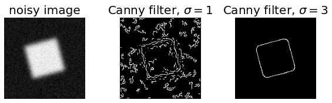
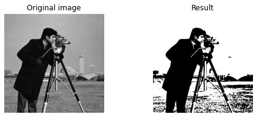
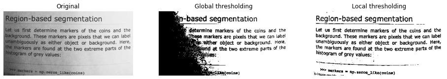
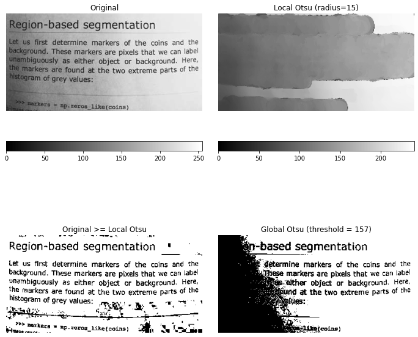
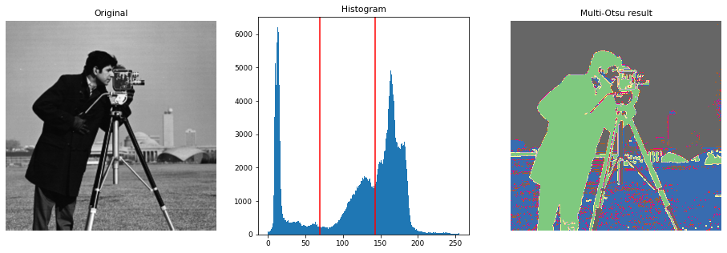
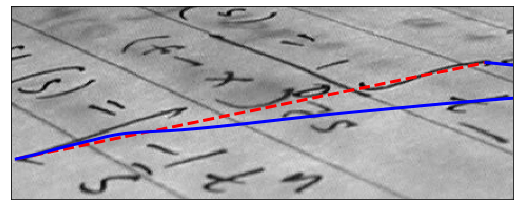

# Implementing Image Segmentation Techniques using Scikit-Image


~ Achyut Morang, <elb17045@tezu.ac.in>

`20 September, 2020`


Report --    [](https://github.com/achyutmorang/Implementing-Image-Segmentation-Techniques-using-Scikit-Image/blob/master/Implementing%20Image%20Segmentation%20Techniques%20using%20Scikit%20Image.pdf)

Experiments --   [](https://colab.research.google.com/github/achyutmorang/Implementing-Image-Segmentation-Techniques-using-Scikit-Image/blob/master/Experiments.ipynb)    [](https://mybinder.org/v2/gh/achyutmorang/Implementing-Image-Segmentation-Techniques-using-Scikit-Image.git/master?filepath=.%2FExperiments.ipynb)


---

_Table of Contents_

[toc]

---


## Introduction


Image segmentation is a critical process in computer vision. It involves dividing a visual input into segments to simplify image analysis. Segments represent objects or parts of objects, and comprise sets of pixels. Image segmentation sorts pixels into larger components, eliminating the need to consider individual pixels as units of observation.

*scikit-image* is a collection of algorithms for image processing. It is available free of charge and free of restriction. We pride ourselves on high-quality, peer-reviewed code, written by an active community of volunteers.

This report is an account of using Scikit-Image -- an open source Python package designed for image preprocessing, to experiment with some of the basic Image Segmentation Techniques as listed below --

1. Edge Detection using  Roberts, Sobel and Prewitt Operators
2. Canny Edge Detection
3. Hysteresis Thresholding
4. Thresholding - local and global
5. Multi-Otsu Thresholding
8. Active Contour Model


## Setup


All the programs and code works were executed on Jupyter environment on my local machine. 

The *Jupyter Notebook* is an open-source web application that allows you to create and share documents that contain live code, equations, visualizations and narrative text. Uses include: data cleaning and transformation, numerical simulation, statistical modeling, data visualization, machine learning, and much more.

Alternatively, one can opt to use Google Colabaortory or Binder to reproduce the experiments.


## Experiments and Results


Importing the necessary libraries of Scikit-Image, NumPy and Matplotlib's pyplot.


```python
import skimage
import numpy as np
import matplotlib.pyplot as plt
```


### 1. Edge Detection using Roberts, Sobel and Prewitt Operators

Edge operators are used in image processing within edge detection algorithms. They are discrete differentiation operators, computing an approximation of the gradient of the image intensity function.
Different operators compute different finite-difference approximations of the gradient.


```python3.8
from skimage import filters
from skimage.data import camera
from skimage.util import compare_images

image = camera()   #from skimage library
plt.imshow(image)
```


```python3.8
edge_roberts = filters.roberts(image)
edge_sobel = filters.sobel(image)
edge_prewitt = filters.prewitt(image)

fig, axes = plt.subplots(ncols=3, sharex=True, sharey=True,
                         figsize=(8, 8))

axes[0].imshow(edge_roberts, cmap=plt.cm.gray)
axes[0].set_title('Roberts Edge Detection')

axes[1].imshow(edge_sobel, cmap=plt.cm.gray)
axes[1].set_title('Sobel Edge Detection')

axes[2].imshow(edge_prewitt, cmap=plt.cm.gray)
axes[2].set_title('Prewitt Edge Detection')

for ax in axes:
    ax.axis('off')

plt.tight_layout()
plt.show()
```


### 2. Canny Edge Detection

The Canny filter is a multi-stage edge detector. It uses a filter based on the derivative of a Gaussian in order to compute the intensity of the gradients.The Gaussian reduces the effect of noise present in the image. Then, potential edges are thinned down to 1-pixel curves by removing non-maximum pixels of the gradient magnitude. Finally, edge pixels are kept or removed using hysteresis thresholding on the gradient magnitude.

The Canny has three adjustable parameters: the width of the Gaussian (the noisier the image, the greater the width), and the low and high threshold for the hysteresis thresholding.


```python3
from scipy import ndimage as ndi
from skimage import feature


# Generate noisy image of a square
im = np.zeros((128, 128))
im[32:-32, 32:-32] = 1

im = ndi.rotate(im, 15, mode='constant')
im = ndi.gaussian_filter(im, 4)
im += 0.2 * np.random.random(im.shape)

# Compute the Canny filter for two values of sigma
edges1 = feature.canny(im)
edges2 = feature.canny(im, sigma=3)

# display results
fig, (ax1, ax2, ax3) = plt.subplots(nrows=1, ncols=3, figsize=(8, 3),
                                    sharex=True, sharey=True)

ax1.imshow(im, cmap=plt.cm.gray)
ax1.axis('off')
ax1.set_title('noisy image', fontsize=20)

ax2.imshow(edges1, cmap=plt.cm.gray)
ax2.axis('off')
ax2.set_title(r'Canny filter, $\sigma=1$', fontsize=20)

ax3.imshow(edges2, cmap=plt.cm.gray)
ax3.axis('off')
ax3.set_title(r'Canny filter, $\sigma=3$', fontsize=20)

fig.tight_layout()

plt.show()
```





### 3. Thresholding

Thresholding is used to create a binary image from a grayscale image. It is the simplest way to segment objects from a background.

Thresholding algorithms implemented in scikit-image can be separated in two categories:

1. Histogram-based. The histogram of the pixels’ intensity is used and certain assumptions are made on the properties of this histogram (e.g. bimodal).
2. Local. To process a pixel, only the neighboring pixels are used. These algorithms often require more computation time.

If you are not familiar with the details of the different algorithms and the underlying assumptions, it is often difficult to know which algorithm will give the best results. Therefore, Scikit-image includes a function to evaluate thresholding algorithms provided by the library. At a glance, you can select the best algorithm for you data without a deep understanding of their mechanisms.


```python
from skimage import data
from skimage.filters import try_all_threshold

img = data.page()

fig, ax = try_all_threshold(img, figsize=(10, 8), verbose=False)
plt.show()
```


Now, we illustrate how to apply one of these thresholding algorithms. This example uses the mean value of pixel intensities. It is a simple and naive threshold value, which is sometimes used as a guess value


```python
from skimage.filters import threshold_mean


image = data.camera()
thresh = threshold_mean(image)
binary = image > thresh

fig, axes = plt.subplots(ncols=2, figsize=(8, 3))
ax = axes.ravel()

ax[0].imshow(image, cmap=plt.cm.gray)
ax[0].set_title('Original image')

ax[1].imshow(binary, cmap=plt.cm.gray)
ax[1].set_title('Result')

for a in ax:
    a.axis('off')

plt.show()
```





#### Bimodal Histogram

For pictures with a bimodal histogram, more specific algorithms can be used. For instance, the minimum algorithm takes a histogram of the image and smooths it repeatedly until there are only two peaks in the histogram.


```python
from skimage.filters import threshold_minimum


image = data.camera()

thresh_min = threshold_minimum(image)
binary_min = image > thresh_min

fig, ax = plt.subplots(2, 2, figsize=(10, 10))

ax[0, 0].imshow(image, cmap=plt.cm.gray)
ax[0, 0].set_title('Original')

ax[0, 1].hist(image.ravel(), bins=256)
ax[0, 1].set_title('Histogram')

ax[1, 0].imshow(binary_min, cmap=plt.cm.gray)
ax[1, 0].set_title('Thresholded (min)')

ax[1, 1].hist(image.ravel(), bins=256)
ax[1, 1].axvline(thresh_min, color='r')

for a in ax[:, 0]:
    a.axis('off')
plt.show()
```


#### Otsu's Thresholding

Otsu’s method calculates an “optimal” threshold (marked by a red line in the histogram below) by maximizing the variance between two classes of pixels, which are separated by the threshold. Equivalently, this threshold minimizes the intra-class variance"


```python
from skimage.filters import threshold_otsu


image = data.camera()
thresh = threshold_otsu(image)
binary = image > thresh

fig, axes = plt.subplots(ncols=3, figsize=(16, 5))
ax = axes.ravel()
ax[0] = plt.subplot(1, 3, 1)
ax[1] = plt.subplot(1, 3, 2)
ax[2] = plt.subplot(1, 3, 3, sharex=ax[0], sharey=ax[0])

ax[0].imshow(image, cmap=plt.cm.gray)
ax[0].set_title('Original')
ax[0].axis('off')

ax[1].hist(image.ravel(), bins=256)
ax[1].set_title('Histogram')
ax[1].axvline(thresh, color='r')

ax[2].imshow(binary, cmap=plt.cm.gray)
ax[2].set_title('Thresholded')
ax[2].axis('off')

plt.show()
```


#### Local Thresholding

If the image background is relatively uniform, then you can use a global threshold value as presented above. However, if there is large variation in the background intensity, adaptive thresholding (a.k.a. local or dynamic thresholding) may produce better results. Note that local is much slower than global thresholding.

Here, we binarize an image using the threshold_local function, which calculates thresholds in regions with a characteristic size block_size surrounding each pixel (i.e. local neighborhoods). Each threshold value is the weighted mean of the local neighborhood minus an offset value.


```python
from skimage.filters import threshold_otsu, threshold_local


image = data.page()

global_thresh = threshold_otsu(image)
binary_global = image > global_thresh

block_size = 35
local_thresh = threshold_local(image, block_size, offset=10)
binary_local = image > local_thresh

fig, axes = plt.subplots(ncols=3, figsize=(16, 16))
ax = axes.ravel()
plt.gray()

ax[0].imshow(image)
ax[0].set_title('Original')

ax[1].imshow(binary_global)
ax[1].set_title('Global thresholding')

ax[2].imshow(binary_local)
ax[2].set_title('Local thresholding')

for a in ax:
    a.axis('off')

plt.show()
```





Now, we show how Otsu’s threshold 2 method can be applied locally. For each pixel, an “optimal” threshold is determined by maximizing the variance between two classes of pixels of the local neighborhood defined by a structuring element.

The example compares the local threshold with the global threshold.


```python
from skimage.morphology import disk
from skimage.filters import threshold_otsu, rank
from skimage.util import img_as_ubyte


img = img_as_ubyte(data.page())

radius = 15
selem = disk(radius)

local_otsu = rank.otsu(img, selem)
threshold_global_otsu = threshold_otsu(img)
global_otsu = img >= threshold_global_otsu

fig, axes = plt.subplots(2, 2, figsize=(10, 10), sharex=True, sharey=True)
ax = axes.ravel()
plt.tight_layout()

fig.colorbar(ax[0].imshow(img, cmap=plt.cm.gray),
             ax=ax[0], orientation='horizontal')
ax[0].set_title('Original')
ax[0].axis('off')

fig.colorbar(ax[1].imshow(local_otsu, cmap=plt.cm.gray),
             ax=ax[1], orientation='horizontal')
ax[1].set_title('Local Otsu (radius=%d)' % radius)
ax[1].axis('off')

ax[2].imshow(img >= local_otsu, cmap=plt.cm.gray)
ax[2].set_title('Original >= Local Otsu' % threshold_global_otsu)
ax[2].axis('off')

ax[3].imshow(global_otsu, cmap=plt.cm.gray)
ax[3].set_title('Global Otsu (threshold = %d)' % threshold_global_otsu)
ax[3].axis('off')

plt.show()
```





### 4. Multi-Otsu Thresholding

The multi-Otsu threshold 1 is a thresholding algorithm that is used to separate the pixels of an input image into several different classes, each one obtained according to the intensity of the gray levels within the image.

Multi-Otsu calculates several thresholds, determined by the number of desired classes. The default number of classes is 3: for obtaining three classes, the algorithm returns two threshold values. They are represented by a red line in the histogram below.


```python
import matplotlib
from skimage.filters import threshold_multiotsu

# Setting the font size for all plots.
matplotlib.rcParams['font.size'] = 9

# The input image.
image = data.camera()

# Applying multi-Otsu threshold for the default value, generating
# three classes.
thresholds = threshold_multiotsu(image)

# Using the threshold values, we generate the three regions.
regions = np.digitize(image, bins=thresholds)

fig, ax = plt.subplots(nrows=1, ncols=3, figsize=(16, 5))

# Plotting the original image.
ax[0].imshow(image, cmap='gray')
ax[0].set_title('Original')
ax[0].axis('off')

# Plotting the histogram and the two thresholds obtained from
# multi-Otsu.
ax[1].hist(image.ravel(), bins=255)
ax[1].set_title('Histogram')
for thresh in thresholds:
    ax[1].axvline(thresh, color='r')

# Plotting the Multi Otsu result.
ax[2].imshow(regions, cmap='Accent')
ax[2].set_title('Multi-Otsu result')
ax[2].axis('off')

plt.subplots_adjust()

plt.show()
```





### 5. Active Contour Model

The active contour model is a method to fit open or closed splines to lines or edges in an image 1. It works by minimising an energy that is in part defined by the image and part by the spline’s shape: length and smoothness. The minimization is done implicitly in the shape energy and explicitly in the image energy.

In the following two examples the active contour model is used (1) to segment the face of a person from the rest of an image by fitting a closed curve to the edges of the face and (2) to find the darkest curve between two fixed points while obeying smoothness considerations. Typically it is a good idea to smooth images a bit before analyzing, as done in the following examples.

We initialize a circle around the astronaut’s face and use the default boundary condition boundary_condition='periodic' to fit a closed curve. The default parameters w_line=0, w_edge=1 will make the curve search towards edges, such as the boundaries of the face.


```python
import numpy as np
import matplotlib.pyplot as plt
from skimage.color import rgb2gray
from skimage import data
from skimage.filters import gaussian
from skimage.segmentation import active_contour


img = data.astronaut()
img = rgb2gray(img)

s = np.linspace(0, 2*np.pi, 400)
r = 100 + 100*np.sin(s)
c = 220 + 100*np.cos(s)
init = np.array([r, c]).T

snake = active_contour(gaussian(img, 3),
                       init, alpha=0.015, beta=10, gamma=0.001)

fig, ax = plt.subplots(figsize=(7, 7))
ax.imshow(img, cmap=plt.cm.gray)
ax.plot(init[:, 1], init[:, 0], '--r', lw=3)
ax.plot(snake[:, 1], snake[:, 0], '-b', lw=3)
ax.set_xticks([]), ax.set_yticks([])
ax.axis([0, img.shape[1], img.shape[0], 0])

plt.show()
```


Here we initialize a straight line between two points, (5, 136) and (424, 50), and require that the spline has its end points there by giving the boundary condition boundary_condition=’fixed’. We furthermore make the algorithm search for dark lines by giving a negative w_line value.


```python
img = data.text()

r = np.linspace(136, 50, 100)
c = np.linspace(5, 424, 100)
init = np.array([r, c]).T

snake = active_contour(gaussian(img, 1), init, boundary_condition='fixed',
                       alpha=0.1, beta=1.0, w_line=-5, w_edge=0, gamma=0.1)

fig, ax = plt.subplots(figsize=(9, 5))
ax.imshow(img, cmap=plt.cm.gray)
ax.plot(init[:, 1], init[:, 0], '--r', lw=3)
ax.plot(snake[:, 1], snake[:, 0], '-b', lw=3)
ax.set_xticks([]), ax.set_yticks([])
ax.axis([0, img.shape[1], img.shape[0], 0])

plt.show()
```





## Conclusion


The above Image Segmentation techniques were experimented using Scikit-Image library package to study and compare the underlying concepts.


#### References

- https://scikit-image.org/docs/stable/auto_examples/
- https://scikit-image.org/docs/dev/user_guide/tutorial_segmentation.html/
- https://scipy-lectures.org/packages/scikit-image/index.html/


